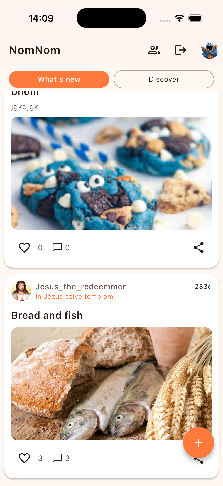
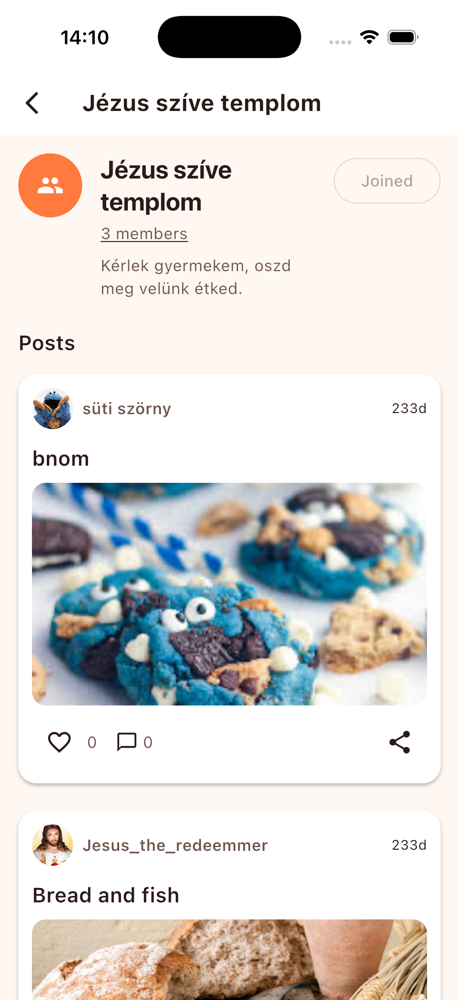

# Nom Nom (Flutter + Node.js + MongoDB)

Cross-platform receptmegosztó alkalmazás Flutter klienssel és Node.js/Express backenddel.  
A projekt Cloudinary-t használ képfeltöltéshez, MongoDB-t adatbázisként, JWT-t autentikációhoz.

---

## Screenshots

<p align="center">
  
</p>

<p align="center">
  
  
  
</p>

---

## Tech stack

- **Frontend:** Flutter
- **Backend:** Node.js, Express.js
- **Auth:** JWT
- **DB:** MongoDB
- **Media storage:** Cloudinary

---

## Előfeltételek

### Általános
- **Git**
- **Node.js** 
- **npm**
- **Flutter SDK**
- **MongoDB** 
### iOS futtatáshoz (kötelező)
- **macOS**
- **Xcode** 
- **Xcode Command Line Tools**
- **iOS Simulator**

Ellenőrzés:
```bash
flutter doctor
xcodebuild -version
```

---

## Projekt struktúra

- `backend/` – Node.js/Express API
- `nomnom_app/` – Flutter app

---

## 1) Backend beállítása és indítása

### 1.1. Függőségek telepítése
```bash
cd backend
npm install
```


### 1.2. Backend indítása
```bash
npm run dev
```

Ellenőrzés:
- API alap URL: `http://localhost:8080`

---

## 2) Flutter app beállítása és futtatása (iOS Simulator)

### 2.1. Függőségek telepítése
```bash
cd ../nomnom_app
flutter pub get
```

---

## 3) iOS Simulator indítása és futtatás

### 3.1. Elérhető eszközök listázása
```bash
flutter devices
```

### 3.2. Futtatás iOS emulátoron
Indíts el egy simulátort (Xcode → Open Developer Tool → Simulator) vagy ``` open -a Simulator.app```, majd:
```bash
flutter run
```

---

## 4) Gyakori hibák / tippek

```bash
cd ios
pod repo update
pod install
cd ..
```

---

## 5) Hasznos parancsok

```bash
flutter clean
flutter pub get
flutter run
```

Backend oldalon:
```bash
npm run dev
npm start
```


---

## Android futtatás


### Előfeltételek (Android)
- **Android Studio** (Android SDK + Emulator miatt)
- **Android SDK Platform Tools** 
- Legalább egy **Android Emulator**  vagy egy **fizikai Android készülék** (USB debugginggel)

Ellenőrzés:
```bash
flutter doctor
flutter devices
```

### Android Emulator (AVD) indítása
1. Android Studio → **Device Manager** (vagy AVD Manager)
2. Hozz létre egy emulátort (pl. Pixel 7, Android 14)
3. Indítsd el az emulátort (▶)

Ezután:
```bash
flutter devices
flutter run -d <android_device_id>
```

### Fizikai Android készülék (opcionális)
1. Engedélyezd a **Developer options**-t és az **USB debugging**-et
2. Csatlakoztasd USB-n
3. Ellenőrzés:
```bash
adb devices
flutter devices
```
Futtatás:
```bash
flutter run -d <device_id>
```

## Flutter futtatása VS Code-ból

### Előfeltételek
- **VS Code**
- **Flutter** és **Dart** VS Code extensionök (Marketplace)
- Flutter SDK telepítve és a PATH-ban
- Legalább egy futtatható eszköz: iOS Simulator / Android Emulator / fizikai készülék

### 1) Projekt megnyitása
- Nyisd meg a Flutter app mappáját (pl. `nomnom_app/`) VS Code-ban.

### 2) Függőségek telepítése
VS Code Terminalban:
```bash
flutter pub get
```

### 3) Eszköz kiválasztása
- A VS Code státuszsorában (jobb alsó sarok) kattints a **Device** feliratra,
  és válaszd ki az iOS Simulatort / Android emulátort.

### 4) Futtatás (Run/Debug)
- Nyisd meg a `lib/main.dart` fájlt
- Nyomd meg: **F5** (Run and Debug), vagy a felső menüben: Run → Start Debugging

Alternatíva Terminalból:
```bash
flutter run
```

### 5) Gyakori VS Code tippek
- Ha nem talál eszközt: indítsd el előbb a Simulatort/Emulatort, majd futtasd:
```bash
flutter devices
```
